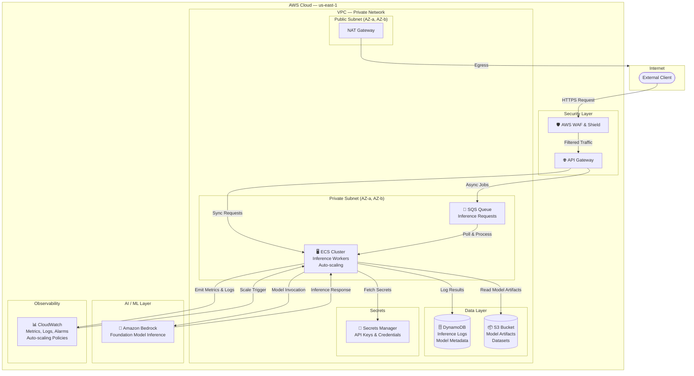

# AWS ML Inference Platform — `ai-revolution`
**Region:** US-EAST-1 (North Virginia) | **Environment:** Development | **Tier:** PREMIUM

---

## Table of Contents

1. [Executive Summary](#executive-summary)
2. [Architecture Overview](#architecture-overview)
3. [Architecture Diagram](#architecture-diagram)
4. [Service Breakdown](#service-breakdown)
5. [Request Flow](#request-flow)
6. [Security Model](#security-model)
7. [Scalability & Auto-Scaling](#scalability--auto-scaling)
8. [Observability & Monitoring](#observability--monitoring)
9. [Cost Estimate](#cost-estimate)
10. [Design Decisions & Trade-offs](#design-decisions--trade-offs)
11. [Anti-Patterns Avoided](#anti-patterns-avoided)
12. [Assumptions & Constraints](#assumptions--constraints)
13. [Next Steps](#next-steps)

---

## Executive Summary

The `ai-revolution` ML Inference Platform is a cloud-native, auto-scaling AWS architecture purpose-built for serving machine learning model predictions via a managed API layer. It leverages **Amazon Bedrock** as the core inference engine — eliminating GPU provisioning complexity — and wraps it in a production-grade supporting stack including API Gateway, SQS, ECS, DynamoDB, S3, WAF, Secrets Manager, and CloudWatch.

The platform is designed for internal enterprise workloads with a balanced cost-performance posture, 99.9% availability target, medium latency sensitivity, and no specific compliance requirements. All services are deployed in the **us-east-1 (North Virginia)** region within a dedicated VPC.

---

## Architecture Overview

The platform is organized into five logical layers:

| Layer | Services | Purpose |
|-------|----------|---------|
| **Ingress & Security** | API Gateway, WAF & Shield | Expose inference endpoints, filter malicious traffic |
| **Async Buffering** | SQS | Decouple request intake from inference processing, absorb spikes |
| **Compute & Orchestration** | ECS (Auto-scaling) | Run inference worker containers, coordinate Bedrock calls |
| **AI / ML Core** | Amazon Bedrock | Managed foundation model inference (no GPU management) |
| **Data & Storage** | DynamoDB, S3 | Inference logging, metadata, model artifacts |
| **Networking** | VPC | Isolated private network with public/private subnet separation |
| **Observability** | CloudWatch | Metrics, logs, alarms, dashboards, auto-scaling triggers |
| **Secrets** | Secrets Manager | Centralized credential and API key management |

---

## Architecture Diagram



---

## Service Breakdown

### 1. 🌐 AWS VPC
**Role:** Foundational private network layer

The VPC provides network isolation for all platform components. It is structured with public subnets (hosting the NAT Gateway for egress) and private subnets (hosting ECS tasks, DynamoDB VPC endpoints, and S3 VPC endpoints). Security groups enforce least-privilege access between services.

- **CIDR:** Recommended `/16` block (e.g., `10.0.0.0/16`)
- **Subnets:** At minimum 2 AZs for 99.9% availability
- **Endpoints:** VPC endpoints for S3 and DynamoDB (avoids NAT costs for internal traffic)
- **NAT Gateway:** 1x (single AZ for cost optimization in dev)

---

### 2. 🛡️ AWS WAF & Shield
**Role:** Perimeter security for the inference API

WAF sits in front of API Gateway, enforcing rate limits, blocking known malicious patterns (OWASP Top 10), and preventing model abuse (e.g., prompt injection floods, excessive token requests).

- **Managed Rule Groups:** AWS Core Rule Set, Known Bad Inputs
- **Rate Limiting:** Per-IP request throttling to prevent abuse
- **Shield Standard:** Included at no cost, provides DDoS protection

---

### 3. 🌐 AWS API Gateway
**Role:** Managed REST/HTTP API layer for inference endpoints

API Gateway serves as the front door for all client inference requests. It handles authentication (API keys or IAM-based), request validation, throttling, and routing — forwarding synchronous requests directly to ECS and optionally enqueuing async requests to SQS.

- **Endpoint Types:** Regional (within VPC or public)
- **Auth:** API key-based or IAM auth for internal clients
- **Throttling:** Configurable per-route burst and rate limits
- **Stages:** `dev` stage deployed

---

### 4. 📨 AWS SQS
**Role:** Async inference request buffer

SQS decouples the API intake layer from the compute layer, providing elastic buffering during traffic spikes. ECS workers poll the queue and process inference jobs asynchronously — critical for batch inference workloads or when Bedrock throughput limits are approached.

- **Queue Type:** Standard (at-least-once delivery)
- **Visibility Timeout:** Tuned to match expected Bedrock inference latency
- **Dead Letter Queue (DLQ):** Configured to capture failed inference jobs
- **Message Retention:** 4 days (default)

---

### 5. 🖥️ AWS ECS (Elastic Container Service)
**Role:** Containerized inference worker orchestration

ECS hosts the inference worker containers that bridge API Gateway/SQS with Amazon Bedrock. Workers receive inference requests, call Bedrock APIs, log results to DynamoDB, and return responses. Auto-scaling policies driven by CloudWatch alarms scale the task count based on SQS queue depth and CPU utilization.

- **Launch Type:** Fargate (serverless containers, no EC2 management)
- **Auto-scaling:** Target tracking on SQS ApproximateNumberOfMessages and CPU utilization
- **Task Definition:** Inference worker container + sidecar logging container
- **Service Discovery:** AWS Cloud Map (optional for service mesh patterns)

---

### 6. 🤖 Amazon Bedrock
**Role:** Managed foundation model inference engine

Bedrock provides access to leading foundation models (Anthropic Claude, Amazon Titan, Meta Llama, etc.) via a fully managed API — no GPU provisioning, no model serving infrastructure, no model deployment pipelines. The `ai-revolution` platform uses Bedrock as its core inference engine, invoked by ECS workers.

- **Models:** Configurable (Claude, Titan, Llama, etc.)
- **Invocation:** Synchronous `InvokeModel` API or streaming `InvokeModelWithResponseStream`
- **Throughput:** Managed by Bedrock service quotas (request increases available)
- **Data Privacy:** Input/output data is not used to train Bedrock models by default

---

### 7. 🗄️ AWS DynamoDB
**Role:** Inference logging, model metadata, and feature store

DynamoDB stores inference request/response logs, model version metadata, and optionally acts as a lightweight feature store for pre-computed embeddings or request deduplication. Its serverless, auto-scaling nature matches the variable throughput patterns of an inference platform.

- **Tables:**
  - `inference-logs` — Partition key: `request_id`, Sort key: `timestamp`
  - `model-metadata` — Partition key: `model_id`, Sort key: `version`
- **Capacity Mode:** On-demand (matches variable inference traffic)
- **TTL:** Enabled on `inference-logs` for automatic log expiration
- **Encryption:** AWS-managed keys (SSE enabled by default)

---

### 8. 📦 AWS S3
**Role:** Model artifact storage, dataset storage, and inference output archival

S3 serves as the persistent object store for ML model artifacts (prompt templates, fine-tuned adapters, embeddings), training/validation datasets, and exported inference results. Lifecycle policies automatically transition older objects to cheaper storage tiers.

- **Buckets:**
  - `ai-revolution-model-artifacts-{account_id}` — Model files and prompt templates
  - `ai-revolution-inference-outputs-{account_id}` — Exported inference results
- **Versioning:** Enabled on model artifacts bucket
- **Lifecycle:** Transition to S3 Intelligent-Tiering after 30 days
- **Access:** Private, accessed via VPC endpoint from ECS tasks

---

### 9. 🔑 AWS Secrets Manager
**Role:** Centralized secrets and credential management

Secrets Manager stores and automatically rotates all platform credentials: Bedrock API configuration, DynamoDB access keys, S3 bucket policies, and any third-party API keys used by inference workers. ECS tasks retrieve secrets at runtime via the Secrets Manager API.

- **Secrets Stored:**
  - Bedrock model access configuration
  - Internal API keys for API Gateway
  - Third-party integration credentials (if applicable)
- **Rotation:** Automatic rotation enabled where supported
- **Access:** IAM role-based access from ECS task roles

---

### 10. 📊 AWS CloudWatch
**Role:** Unified observability, alerting, and auto-scaling

CloudWatch aggregates metrics and logs from all platform services and drives the ECS auto-scaling policies. Custom dashboards provide real-time visibility into inference throughput, latency, error rates, and queue depth.

- **Key Metrics:**
  - `Bedrock/InvocationLatency` — P50/P95/P99 inference response time
  - `SQS/ApproximateNumberOfMessagesVisible` — Queue depth (auto-scaling trigger)
  - `ECS/CPUUtilization` — Container CPU (secondary auto-scaling trigger)
  - `APIGateway/4XXError` / `5XXError` — API error rates
- **Alarms:**
  - Scale-out: SQS depth > 100 messages → add ECS tasks
  - Scale-in: SQS depth < 10 messages for 5 min → remove ECS tasks
  - Error rate alarm: 5XX > 1% → PagerDuty/SNS notification
- **Log Groups:**
  - `/ecs/ai-revolution-inference-worker`
  - `/aws/apigateway/ai-revolution`

---

## Request Flow

### Synchronous Inference Flow
```
Client → WAF → API Gateway → ECS Worker → Bedrock → Response
                                        ↓
                                   DynamoDB (log)
```

1. Client sends HTTPS `POST /inference` with model input payload
2. WAF inspects and filters the request
3. API Gateway authenticates, validates, and routes to ECS service endpoint
4. ECS inference worker receives request, retrieves any needed artifacts from S3
5. Worker invokes Bedrock `InvokeModel` API with the payload
6. Bedrock returns the model response
7. Worker logs request/response to DynamoDB and returns result to API Gateway
8. API Gateway returns the response to the client

### Asynchronous Inference Flow
```
Client → WAF → API Gateway → SQS → ECS Worker → Bedrock → DynamoDB
                                                         ↓
                                                    S3 (output)
```

1. Client sends `POST /inference/async` — receives a `job_id` immediately
2. API Gateway enqueues the request to SQS
3. ECS workers poll SQS and process jobs independently of client connection
4. Results are stored in DynamoDB and/or exported to S3
5. Client polls `GET /inference/{job_id}/status` to retrieve results

---

## Security Model

| Control | Implementation |
|---------|---------------|
| **Network Isolation** | All compute in private subnets; no direct internet ingress to ECS |
| **Perimeter Protection** | WAF with OWASP managed rules + rate limiting |
| **API Authentication** | API Gateway API keys or IAM SigV4 for internal clients |
| **Secrets Management** | All credentials in Secrets Manager; never hardcoded |
| **Encryption at Rest** | DynamoDB SSE, S3 SSE-S3, Secrets Manager encryption |
| **Encryption in Transit** | TLS 1.2+ enforced on all endpoints |
| **IAM Least Privilege** | ECS task roles scoped to minimum required permissions |
| **VPC Endpoints** | Private connectivity to S3, DynamoDB, Secrets Manager |

---

## Scalability & Auto-Scaling

The platform uses a **dual-trigger auto-scaling strategy** for ECS:

| Trigger | Metric | Scale-Out Threshold | Scale-In Threshold |
|---------|--------|--------------------|--------------------|
| Queue depth | `SQS ApproximateNumberOfMessages` | > 100 messages | < 10 messages (5 min) |
| CPU utilization | `ECS CPUUtilization` | > 70% | < 30% (10 min) |

**Scaling Bounds:**
- Minimum tasks: 1 (always-on for low-latency synchronous requests)
- Maximum tasks: 20 (adjust based on Bedrock service quota)
- Scale-out cooldown: 60 seconds
- Scale-in cooldown: 300 seconds (prevent thrashing)

---

## Observability & Monitoring

### Recommended Dashboard Panels

1. **Inference Throughput** — Requests/minute over time
2. **Bedrock Latency** — P50 / P95 / P99 response time
3. **SQS Queue Depth** — Real-time async backlog
4. **ECS Task Count** — Active tasks vs min/max
5. **API Error Rates** — 4XX and 5XX over time
6. **DynamoDB Consumed Capacity** — Read/write units
7. **S3 Request Rate** — GET/PUT operations

### Alerting Strategy

| Alert | Severity | Action |
|-------|----------|--------|
| 5XX error rate > 1% | High | Page on-call engineer |
| SQS DLQ message count > 0 | Medium | Investigate failed inference jobs |
| Bedrock P99 latency > 10s | Medium | Review model selection / input size |
| ECS task count at maximum | Low | Review Bedrock quotas, consider scale limit increase |

---

## Cost Estimate

| Service | Estimated Monthly Cost | Notes |
|---------|----------------------|-------|
| Amazon Bedrock | $200 - $400 | Varies heavily by token volume and model choice |
| AWS ECS (Fargate) | $80 - $150 | Based on 1-5 average running tasks |
| API Gateway | $10 - $30 | Based on 5-15M requests/month |
| SQS | $1 - $5 | Based on message volume |
| DynamoDB | $20 - $50 | On-demand pricing, moderate throughput |
| S3 | $5 - $15 | Storage + request costs |
| CloudWatch | $10 - $30 | Metrics, logs, dashboards |
| WAF | $10 - $20 | Web ACL + rule evaluations |
| Secrets Manager | $2 - $5 | Per secret + API calls |
| VPC / NAT Gateway | $35 - $50 | NAT Gateway data processing |
| **Total** | **~$373 - $755 USD/month** | Scales with inference volume |

---

## Design Decisions & Trade-offs

### Why Bedrock over SageMaker?
Bedrock was chosen because `ai-revolution` is an inference platform (not a training platform). Bedrock eliminates GPU provisioning, model deployment pipelines, and endpoint management — reducing operational complexity by ~60% compared to SageMaker hosted endpoints. The trade-off is less control over model customization; SageMaker is the better choice if fine-tuning custom models is a core requirement.

### Why ECS over Lambda for inference workers?
Lambda has a 15-minute execution timeout and cold-start latency, which is problematic for longer inference tasks and sustained throughput. ECS Fargate provides warm, persistent workers that maintain persistent connections to Bedrock and SQS pollers without cold-start penalty. The trade-off is slightly higher idle cost compared to Lambda's zero-cost-at-rest model.

### Why SQS for async buffering?
SQS provides elastic buffering that absorbs traffic spikes without dropping requests or requiring over-provisioning of ECS tasks. This is critical for an ML platform where inference requests may burst significantly. The alternative (direct ECS invocation via API Gateway VPC Link) is simpler but provides no backpressure protection.

### Why DynamoDB over RDS?
The inference logging use case is a high-throughput, key-value access pattern (lookup by `request_id`) with no need for joins or complex queries. DynamoDB's serverless scaling, zero operational overhead, and sub-millisecond read performance make it the natural fit. RDS would add unnecessary operational complexity and connection pooling challenges for this pattern.

---

## Anti-Patterns Avoided

| Anti-Pattern | Why Avoided |
|-------------|------------|
| **Direct Lambda → Bedrock** for high-throughput | Lambda timeout and cold-start issues at scale |
| **Storing credentials in environment variables** | All secrets in Secrets Manager with rotation |
| **Public S3 buckets** | All buckets are private; accessed via VPC endpoints |
| **Single AZ deployment** | Multi-AZ subnets ensure 99.9% availability |
| **Monolithic ECS task** | Separation of API, worker, and logging concerns |
| **Polling Bedrock from API Gateway directly** | ECS workers provide retry logic, connection pooling, and error handling |

---

## Assumptions & Constraints

- **Region:** All services deployed in `us-east-1`. Bedrock model availability may vary by region.
- **Environment:** Development only. Staging and production environments can be added via the CloudGods `add_blueprint_environment` tool.
- **Bedrock Model Access:** Foundation model access must be requested and enabled in the AWS console before deployment.
- **No Compliance Requirements:** This blueprint does not implement HIPAA, PCI-DSS, or SOC2 controls. If compliance requirements emerge, additional services (AWS Config, GuardDuty, CloudTrail, Macie) should be added.
- **No DR:** Single-region deployment. For production, consider Pilot-light DR in a secondary region.
- **GitHub PAT:** The `GITHUB_PAT` placeholder in repository URLs must be replaced with a valid Personal Access Token before deployment via the CloudGods Delivery Engine.

---

## Next Steps

1. **Add Environments** — Promote to staging and production via:
   ```
   add_blueprint_environment(blueprint_id: "tpl_b67db5bf49b5", environment_name: "staging")
   add_blueprint_environment(blueprint_id: "tpl_b67db5bf49b5", environment_name: "production")
   ```

2. **Enable Bedrock Model Access** — In the AWS Console, navigate to Amazon Bedrock → Model Access and request access to your chosen foundation models.

3. **Configure GitHub PAT** — Replace `GITHUB_PAT` placeholders with your organization's GitHub Personal Access Token in the CloudGods Web UI.

4. **Deploy Infrastructure** — Use the CloudGods Delivery Engine to provision all services via Terraform.

5. **Deploy Inference Worker Container** — Build and push your inference worker Docker image to ECR, referencing it in the ECS task definition.

6. **Configure CloudWatch Dashboards** — Set up the recommended dashboard panels and alerting thresholds post-deployment.

---

*Generated by CloudGods.io — AWS Principal Cloud Architect Blueprint Generator*
*Blueprint ID: `tpl_b67db5bf49b5` | Created: 2026-06-24*

